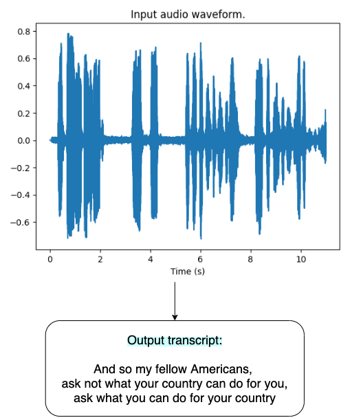
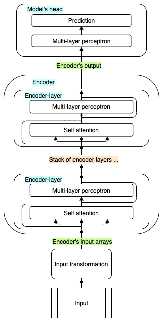
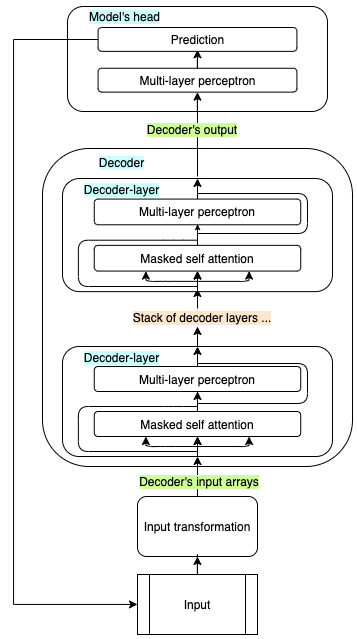
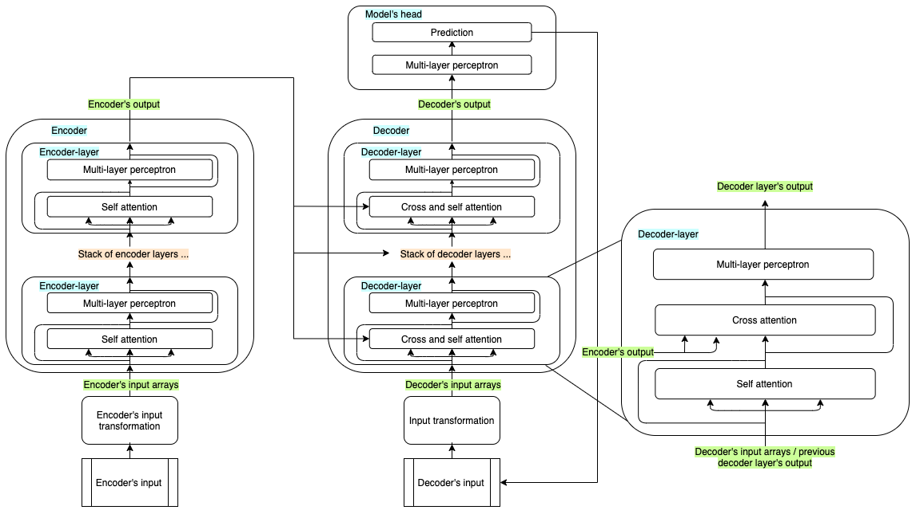
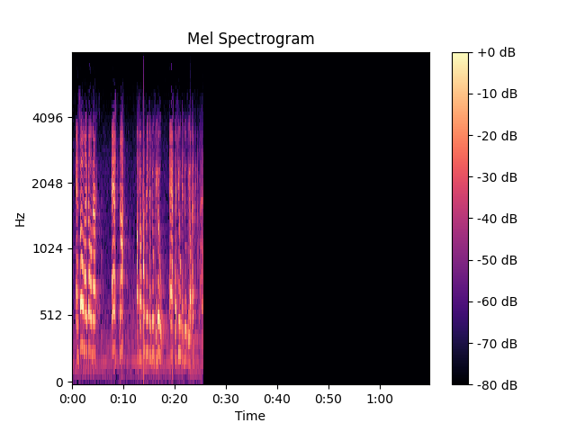

# Whisper summary
In this article, we will go through the main concepts and findings related to the latest end-to-end speech recognition model developed by OpenAI: **[Whisper](https://cdn.openai.com/papers/whisper.pdf)**. The goal of the research was to develop a single robust speech processing system that works reliably without the need for dataset specific fine-tuning to achieve high-quality results on specific distributions. Keep this in mind while reading. Code and model weights have been published on [Github](https://github.com/openai/whisper).

This article aims to summarize and simplify the paper by touching on the key concepts, explaining how the model transcribes the audio input at high-level, and presenting the  most important reuslts in a way suitable for an audience not necessarly used to read ML papers.
Some code snippets will be used to show how the data is transformed across the transcription process, and to cover important concepts which the authors simply referenced to. However, coding skills are not required to grasp Whisper's potential.

## Table of content
1. [Introduction](#introduction)
2. [Datasets](#datasets)
3. [Model architecture](#model)
   * [Transformers](#transformer-models)
   * [Audio preprocessing](#audio-preprocessing)
   * [Encoder](#encoder)
   * [Text preprocessing](#text-preprocessing)
   * [Decoder](#decoder)
4. [Tasks](#tasks)
5. [An end-to-end example](#example)
6. [Evaluation](#evaluation)
   * [Metric](#metric)
   * [English](#english)
   * [Multilingual](#multilingual)
   * [Translation](#translation)
   * [Scaling laws](#scaling-laws)
   * [Noise robustness](#noise-robustness)
7. [Recap](#recap)
7. [What's next](#conclusion)

## Introduction
Recent progress in Automatic Speech Recognition (ASR) have been primarily based on the approach dominating the latest years in Natural Language Processing (NLP) and Computer Vision (CV): transfer learning. This technique consits of pretrainig large models in a self-supervised fashion on massive datasets to perform one or several basic tasks. Then, one or more models are fine-tuned on specific tasks and datasets in a full supervised way.

According to the authours, this approach - although it led to models achieving state-of-the-art results on most benchmarks, often surpassing human baselines - has limitations. First, these models need to be fine-tuned on specific tasks, consuming resources and generating countless versions to manage. But most important, models fine-tuned on specific datasets have shown poor generalization even with minor changes in the target distribution.

In this paper, it is shown that ASR models pretrained with full or weak supervision on end tasks exhibit higher robustness and generalize better. As it is well known by every Machine Learning practicioner, labelling large datasets is expensive and tedious and therefore the trade-off between quality and quantity plays a crucial role. ASR makes no expection.

Whisper training is weakly supervised, meaning that - in most of the training dataset - the only information available is the input audio and the corresponding transcript.

<div class="img-div-any-width" markdown="0">
  
  <br />

</div>

Models of different dimentsions have been trained and evaluated, as illustrated in this table.

| Model   | Parameters |
| -----   | ---------- |
| Tiny    | 39M        |
| Base    | 74M        |
| Small   | 244M       |
| Medium  | 769M       |
| Large   | 1550M      |

The large model achieves great zero-shot results on gold standard benchmarks. We will see more about the results later on, but first let's have a look at the training data.

## Datasets
Similar to most of the recent text datasets, the one used to train Whisper is web-crawled. This results in a very diverse dataset covering a broad distribution of audio from many different environments, recording setups, speakers, and languages. However, many transcripts on the internet have been generated by other ASR models, which are harming Whisper's training quality and have to be filtered out. The authors use a set of euristics to detect and clean the dataset from automatically generated transcripts.

Long audio files are splitted into 30 seconds chunks and paired with the subset of the transcript occurring within that time window. Authors furthermore use fuzzy de-duping of transcript texts to reduce the amount of duplication. Fuzzy-what? Maybe I should write something about this.

Interestingly, transcripts are not preprocessed. The dataset size is such that this does not harm the model's performance: in fact, it removes the need for an inverse text normalization postprocessing step (e.g.: `"my name is emilio and i love asr"` -> `"My name is Emilio, and I love ASR."`).
In simpler words, it means that the model predicts also punctuation, digits, and capitalazion.

Two separate language identification models have been trained on specific datasets - one for audio, and one for text - and are used during training to ensure that corresponding audio-transcript pairs are in the same language. There is though an exception...

As said, the model is trained to map an input audio to an output transcript. However, considering the variety in the dataset, the tasks the model learns to perform are actually more, and include:
* transcribe in the same language (`transcribe`)
* transcribe in English (`translate`)
* predict silence (yeah, we don't always know a-priori that someone is actually speaking...)

The dataset contains 97 languages and is composed of:
* 65% (438.218h) English speech recognition (`English` audio -> `English` transcript)
* 18% (125.739h) Translation speech recognition (`X` audio -> `English` transcript)
* 17% (117.113h) X speech recognition (`X` audio -> `X` transcript)
where X is any of the other 96 languages. Please take a look at the paper's Appendix E if you are interested in more details about then training dataset statistics.

Now you should know which is the above-mentioned exception: human-produced English transcripts are always preserved, so that the model learns to transcribe any spokent language directly in English.

Nice, now we have an idea about the fuel. But what about the engine? Well, let's find out.

## Model
As the research goal was to focus more on the impact of the training process, the authors chose a standard [encoder-decoder transformer model architecture](https://arxiv.org/pdf/1706.03762.pdf) which has shown to scale reliably. We will dive deep into its structure in one of the future posts, where we will investigate the impact of fine-tuning and optimisation techniques. In this article, we will go through the main architectural components to get the big picture, but an excellent (illustrated) deep dive is provided by Jay Alammar in his notorious blog post: [The Illustrated Transformer](https://jalammar.github.io/illustrated-transformer/).

Readers which are not interested into the model architecture can just have a look at the overall architecture diagram LINK PICTURE and continue reading the [Tasks](#tasks) and [Evaluation](#evaluation) chapters. 

### Transformer models
Transformer models are based on the attention mechanism, thanks to which they learn how different input features relate with each, or as the name suggests, what to pay more attention to. An excellent (visual) deep dive is provided by Jay Alammar in his notorious blog post: [The Illustrated Transformer](https://jalammar.github.io/illustrated-transformer/). 

As usual in ML, the input is first transformed into a suitable form: for example, strings are mapped to numerical representations and then to dense arrays, the so-called embeddings. The embedded input is then propagated through an encoder, a decoder, or both, before being passed to the model's head. Encoders and decoders of a standard transformer are built as stacks of encoder and decoder layers respectively: all layers have the exact same architecture, but do not share the weights.

Encoder-only models propagate the whole input through the encoder at once, and its output is then passed through the model's head, which is designed and trained to solve one or more specific tasks.

<div class="img-div-any-width" markdown="0">
  
  <br />

</div>

Decoder-only models are similar, but the output is generated one step at the time, thus the model cannot look at future values. Each newly generated output is concatenated to its input, and used as input in the next iteration.

<div class="img-div-any-width" markdown="0">
  
  <br />

</div>

Encoder-decoder models like the origianl Transformer, Whisper, and many others, are often used to solve sequence-to-sequence tasks (speech-to-text, translation, summarization, ...) and combine both blocks. The whole input is first passed through the encoder, and the encoder output is passed to each of the decoder's layers. The decoder receives also its own input sequence, which is used to predict the next token, together with the information received by the encoder. The predicted token gets concatenated to the previous ones, and the new sequence is passed through the decoder again. This process continues until an *<< end of sequence >>* token is predicted, or other stopping criteria is fulfilled.

<div class="img-div-any-width" markdown="0">
  
  <br />

</div>

### Audio preprocessing
Whisper preprocesses the audio in three main steps.

Initially, the audio is resampled at 16.000 KHz (all datasets used to train the models have been resampled to this frequency, since most benchmarks use it), and padded or trimmed to 30 seconds. During training, the authors have also scaled all inputs between -1 and +1. The global input mean was approximately 0.

Then, "an 80-channel log-magnitude Mel spectrogram representation on 25-milliseconds windows with a stride of 10 milliseconds" is computed.
Whoho, a lot of fancy words here, but what is a log-Mel spectrogram, and why is it used?

Without entering into many details, the input audio is converted from the time domanin to the frequency domanin. Every signal (and audio makes no exception) can be decomposed into a sum of fundamental signals, each with its own frequency and amplitude, using the Fourier transform forumla. The result is the sectrum of the signal.

Of course, the frequencies composing our input audio signal vary over time, so we need to calculate them at different time instants. Whisper calculates the Fourier transform of a 25 milliseconds window of the input audio, then it moves forward of 10 milliseconds and compute it again. So, on a 30 seconds audio, we will calculate the Fourier transform 3000 times.

Alright, this might already be a lot to digest, but there is a last ingredient. Humans hear frequencies in a particular scale, the mel scale is so that equal distances between two frequencies correspond to equal differences in the human perception. Therefore, the y-axis is converted to the Mel scale and divided into 80 bins.

The y-axis, which represents the amplitude of each frequency, is fianlly converted to a log scale.

Yup! We now have our log-mel spectrogram with 80 channels computed on 25 milliseconds windows with a stride of 10 milliseconds.

I understood the log-mel spectrogram thanks to [Leland Robert's great article](https://medium.com/analytics-vidhya/understanding-the-mel-spectrogram-fca2afa2ce53) posted on Medium. I am sure it will help you as well.

The following image is converted to decibels for visualization.
<div class="img-div-any-width" markdown="0">
  
  <br />

</div>

This is how the data representing 11 seconds of audio changes when transformed into a log-mel spectrogram.

```python
# Import libraries
>>> import librosa
>>> from transformers import WhisperProcessor

# Load AND RESAMPLE input audio
>>> data, samplerate = librosa.load("audio/jfk.flac", sr=16.000)
>>> samplerate
16000
>>> data.shape
(176000,)
>>> data.max(), data.min(), data.mean(), data.std()
(0.78274125, -0.72361434, 1.3705251e-05, 0.1421046)

# Compute log-mel spectrogram
>>> processor = WhisperProcessor.from_pretrained("openai/whisper-large")
>>> input_features = processor(data, return_tensors="pt").input_features
(tensor(1.4613), tensor(-0.5387), tensor(-0.2950), tensor(0.4221))

# remember that all audio inputs are padded/trimmed to 30 seconds
# 10 milliseconds stride means 100 samples per second are calculated
# which translates to 3000 samples per 30 seconds of audio
>>> input_features.shape
torch.Size([1, 80, 3000])

# WhisperProcessor handles input in batches, so we just look at the first (and only) batch element
>>> input_features[0].shape
torch.Size([80, 3000])

[...]
```

Next, the log-mel spectrogram is filtered by two convolution layers with a filter width of 3 and GELU activation function. The first layer has a stride of 1, while the second layer has a stride of 2.

```python
# Import libraries
>>> from torch.nn.functional import gelu
>>> from transformers import WhisperProcessor, WhisperForConditionalGeneration

# Load model and apply convolution
>>> model = WhisperForConditionalGeneration.from_pretrained("openai/whisper-large")

>>> conv_1_output = gelu(model.model.encoder.conv1(input_features))
>>> conv_1_output.shape
torch.Size([1, 1280, 3000])
>>> conv_1_output.max(), conv_1_output.min(), conv_1_output.mean(), conv_1_output.std()
(tensor(3.2739, grad_fn=<MaxBackward1>),
 tensor(-0.1700, grad_fn=<MinBackward1>),
 tensor(0.0388, grad_fn=<MeanBackward0>),
 tensor(0.0838, grad_fn=<StdBackward0>))

>>> conv_2_output = gelu(model.model.encoder.conv2(conv_1_output))
>>> conv_2_output.shape
torch.Size([1, 1280, 1500])
>>> conv_2_output.max(), conv_2_output.min(), conv_2_output.mean(), conv_2_output.std()
(tensor(8.1401, grad_fn=<MaxBackward1>),
 tensor(-0.1700, grad_fn=<MinBackward1>),
 tensor(0.2311, grad_fn=<MeanBackward0>),
 tensor(0.4213, grad_fn=<StdBackward0>))

```

To conclude, sinusoidal position embeddings are added to the output of the convolution layers (permuted, to match the dimensionality).

Intuitively, the order of the spoken words matter. However, the encoder handles the whole input at once (and splits across several attention heads, to parallelize computation and speed training up). This means that the model loses any information about the original input position.

The positional information is preserved by encoding it into an array, and using the sine/cosine of each position has multiple benefits: we get a unique encoding for each time step, and it allows the model to generalize well with longer inputs since the distance between any pair of times steps is consistent regardless of the lenght. To better understand how this works, I recommend you to read [Amirhossein Kazemnejad's blog post](https://kazemnejad.com/blog/transformer_architecture_positional_encoding/).

Please note that the positional embeddings dimensionality must match the input's.

```python
# Rename input features variable
>>> inputs_embeds = conv_2_output

# Get sinusoidal position embeddings from the model
>>> embed_pos = self.embed_positions.weight
>>> embed_pos.shape
torch.Size([1500, 1280])
>>> embed_pos.max(), embed_pos.min(), embed_pos.mean(), embed_pos.std()
(tensor(1., grad_fn=<MaxBackward1>),
 tensor(-1., grad_fn=<MinBackward1>),
 tensor(0.2074, grad_fn=<MeanBackward0>),
 tensor(0.6760, grad_fn=<StdBackward0>))

# Permute input_embeds to be able to sum sinusoidal position embeddings
>>> inputs_embeds = inputs_embeds.permute(0, 2, 1)
>>> inputs_embeds.shape
torch.Size([1, 1500, 1280])

# Add positional information to embeddings
>>> inputs_embeds = inputs_embeds + embed_pos
>>> inputs_embeds.shape
torch.Size([1, 1500, 1280])
>>> inputs_embeds.max(), inputs_embeds.min(), inputs_embeds.mean(), inputs_embeds.std()
(tensor(8.9507, grad_fn=<MaxBackward1>),
 tensor(-1.1700, grad_fn=<MinBackward1>),
 tensor(0.4385, grad_fn=<MeanBackward0>),
 tensor(0.7709, grad_fn=<StdBackward0>))

```

Alright, at this point the input embeddings can be propagated through the encoder.

### Encoder
Whisper's encoder thus receives the preprocessed audio input, and transforms it by a forward pass through its layers.
Just to recall, an input audio of 11 seconds, which is a one-dimensional array of 176.000 elements when sampled at 16000 samples per seconds (16 KHz), becomes a 2D array of 1500 x 1280 after preprocessing. The dimensionality is preserved through the encoder's forward pass.

### Text preprocessing
As mentioned in the [Transformer models paragraph](#transformer-models), machine learning models are not suitable for handling strings, neither as input nor as output. The job of splitting strings into tokens (single characters, punctuations, numbers, subwords, words) and mapping tokens to integers, and viceversa, is handled by the tokenizer.

```python
# Example sentence
>>> original_input = "This is a tokenization example"
# Split sentence into a list of tokens and map them to integers (token ids)
>>> token_ids = processor.tokenizer.encode(original_input)
# Get list of tokens from token ids
>>> tokens = processor.tokenizer.batch_decode(token_ids)
# Reconstruct the whole sentence from token ids
>>> reconstructed_input = processor.tokenizer.decode(token_ids)

>>> original_input
'This is a tokenization example.'

>>> tokens
['This', ' is', ' a', ' ', 't', 'oken', 'ization', ' example', '.']

>>> token_ids
[5723, 307, 257, 220, 83, 8406, 2144, 1365, 13]

>>> reconstructed_input
'This is a tokenization example.'
```

A token is simply the smallest unit the model is going to handle. A key parameter is the vocabulary size, which is the number of different tokens the tokenizer is aware of. Whisper uses the BPE tokenizer which was trained for GPT2 to process English text. Other langauges use the same tokenizer, which is fit on the specific language but preserves the same size. The way tokenizers learn to split sentences into words or subwords goes beyond the scope of the article, but I hope you will soon understand how it fits into the picture.

However, simply representing a text as a sequence of integers is not ideal. Think about this minimal example, and remember that models "simply" process numbers: 
```python
>>> token_ids = tokenize(["Whisper", "is", "a", "great", "model"])
>>> token_ids
[1,2,3,4,5]
```
What does this mean to the model? Is the word `"model"` five times more important than the word `"Whisper"`? One solution would be to represent the inputs with one-hot vectors, which are vectors of all zeros, and a one in the position corresponding to the integer to be represented. 

```python
>>> one_hot_encodings = one_hot_encoding(token_ids)
>>> one_hot_encodings
[[1,0,0,0,0],
 [0,1,0,0,0],
 [0,0,1,0,0],
 [0,0,0,1,0],
 [0,0,0,0,1]]

>>> one_hot_encodings.shape
(NUM_INPUT_WORDS, VOCABULARY_SIZE)
```

In fact, a one-hot encoding is usually input format with which tokenized texts are passed to the models. As you can imagine, such representation with a vocabulary of tens of thousands of words leads to a very sparse representation - more than 99% of the input values would be zeros - which harms the model performance. To cope with this issue, the matrix is fed through an embedding layer, which transforms it to a dense representation.
Here, the key parameter is the embedding dimensionality.

```python
>>> embedding_size = 10
>>> embeddings = embed(one_hot_encodings)
>>> embeddings
[[0.67539001, -0.02781102, 0.7405842, 0.92543957, -0.82743469,
 -0.8399026, -0.90059809, -0.1726493, -0.44334005, -0.69554916],
 [-0.95575285, 0.79144297, -0.06387612, 0.88995377, 0.11384941,
 0.87697974, -0.62919236, 0.64791116, -0.90305178, -0.59374918],
 [ 0.17804501, -0.11817887, -0.74232328, 0.40329305, -0.10807508,
 -0.05667099, -0.64122679, -0.96651145, 0.99033302, 0.81605493],
 [ 0.47344379, -0.59197299, -0.88876534, 0.12615804, 0.91232643,
 0.89029839, 0.40303782, -0.19380694, 0.29575598, -0.97647317],
 [ 0.95680021, 0.23221837, 0.56459264, -0.85751143, -0.65173394,
 -0.99427018, 0.43448618, 0.81102759, 0.35889378, -0.06338368]]
>>> embeddings.shape
torch.Size([5,10])
```

Much better. So, if we tokenize and embed `"This is a tokenization example"` using Whisper large model's tokenizer and embedding layer, we get the following representations:
```python
>>> tensor_token_ids = torch.tensor(token_ids)
>>> tensor_token_ids
tensor([5723, 307, 257, 220, 83, 8406, 2144, 1365])
>>> tensor_token_ids.shape
torch.Size([8])

>>> embeddings = model.model.decoder.embed_tokens(tensor_token_ids)
>>> embeddings
tensor([[-0.0014, -0.0077,  0.0017,  ..., -0.0049,  0.0080,  0.0095],
        [ 0.0061,  0.0101, -0.0050,  ...,  0.0026, -0.0058,  0.0113],
        [-0.0031,  0.0004,  0.0324,  ...,  0.0125, -0.0039,  0.0029],
        ...,
        [-0.0028, -0.0133, -0.0061,  ..., -0.0118,  0.0086,  0.0071],
        [-0.0139, -0.0101, -0.0157,  ..., -0.0128,  0.0046,  0.0005],
        [-0.0026, -0.0127, -0.0026,  ..., -0.0009,  0.0128,  0.0120]],
       grad_fn=<EmbeddingBackward0>)
>>> embeddings.shape
torch.Size([8, 1280])
```

We can see that the embedding dimensionality is 1280. This is an hyperparameter which could be tuned, but usually that's the order of magnitude used. This is briefly how text inputs are transformed before being fed to the first decoder layer.

### Decoder
Whisper's decoder instead receives, at each iteration, the preprocessed tokens which have been predicted until the previous iteration. Furthermore, each layer receives the encoder's output, as shown in the last image of the [Transformer models](#transformer-models) paragraph of this chapter.

The decoder's output is then fed to the model's head to make a prediction. But what does it actually predict? The head is a linear layer which outputs an array of size equal to the vocabulary size. This vector is then passed through a softmax function, which transforms it into a probability distribution over the vocabulary. In the most basic approach, the word with the highest probability is then chosen as the next word to be predicted. This is called `greedy search`. However, it is not the only one. In fact, the decoder can be configured to use a beam search, which is a more sophisticated approach which can be used to improve the model's performance.
We will investigate the impact of different decoding strategies in a future article.

### Hyperparameters
In the design and training of a model like Whisper, many hyperparameters play a crucial role. I believe a detailed analysis is beyond the scope of this post, but the paper presents them all, so I encourage curious readers to have a look at it.

## Tasks
The main contribution of Whisper's paper is the way to drive the model to perform a specific task. As the model is an encoder-decoder transformer, each inference is initialized with an input AND a sequence of `start` tokens, of which the first is `"<|startoftranscript|>"` (BOS).

Next, the language is provided. In practice, though, Whisper can also be used to perform langauge identification. Since the model was trained to predict sequences which were always starting with [`"<|startoftranscript|>"`, `<|languagecode|>`, ...], Whisper will predict, as second token, the language it thinks is spoken in the audio segment.

After, comes the main task. Since the authors refer to `transcribe` as the task to transcribe the content of an audio file in the same language, and to `translate` as the task to transcribe the audio file in English when English was not the language spoken, the third token should either be `"<|transcribe|>"` or `"<|translate|>"`.

Last, the model was trained to predict tokens timestamps when available in the training data, and a `"<|notimestamp|>"` token was added after the main task when no such information was provided. Timestamps are predicted relative to the current audio segment and quantised to 20 milliseconds, and added to the vocabulary. The model then predicts: [..., `token_start_time`, `token`, `token_end_time`, `token_start_time`, ...]. If the token audio is not entirely included in the 30 seconds chunk, then no `token_end_time` will be predicted. This indicates that the next segment should be shifted back to include the beginning of the last token of the current chunk, for it allows accurate long-audio transcriptions.

Each transcript was closed with a `"<|endoftranscript|>"` token (EOS). An EOS token being predicted indicates that the transcription is completed, and no further tokens should be predicted or considered. It is the stop signal.

## Example
Let's put all the pieces together. We will use the Huggingface implementation to transcribe the audio file used by OpenAI to test their codebase.


Note that, at the time of writing, this implementation does not allow to include timestamps which means they will be skipped even if we don't set the `"<|notimestamps|>"` input token.

Model and processor implementation details will be covered in a future article.

```python
# Import required packages
>>> import librosa
>>> from transformers import WhisperProcessor, WhisperForConditionalGeneration

# Load processor: feature processor (audio) + tokenizer (text)
>>> processor = WhisperProcessor.from_pretrained("openai/whisper-large")

# Load model architecture and weights
>>> model = WhisperForConditionalGeneration.from_pretrained("openai/whisper-large")

# Load audio file
>>> reference_transcription = "And so my fellow Americans, ask not what your country can do for you, ask what you can do for your country."
>>> data, samplerate = librosa.load("audio/jfk.flac", sr=16000)
>>> data
array([-3.1826513e-08, -5.7742401e-08, -6.5911493e-08, ...,
       -7.7829091e-03, -1.8314138e-02, -1.4547420e-02], dtype=float32)

# File duration (seconds) * Sample rate
>>> data.shape
(176000,)

# Max, min, average and standard deviation
>>> data.max(), data.min(), data.mean(), data.std()
(0.78274125, -0.72361434, 1.3705251e-05, 0.1421046)

# Convert input audio to log-mel spectrogram
>>> input_features = processor(data, return_tensors="pt").input_features

>>> input_features
tensor([[[-0.5387, -0.5387, -0.5387,  ..., -0.5387, -0.5387, -0.5387],
         [-0.5387, -0.5387, -0.5387,  ..., -0.5387, -0.5387, -0.5387],
         [-0.5387, -0.5387, -0.5387,  ..., -0.5387, -0.5387, -0.5387],
         ...,
         [-0.5387, -0.5387, -0.5387,  ..., -0.5387, -0.5387, -0.5387],
         [-0.5387, -0.5387, -0.5387,  ..., -0.5387, -0.5387, -0.5387],
         [-0.5387, -0.5387, -0.5387,  ..., -0.5387, -0.5387, -0.5387]]])

# The first dimension is the batch size
>>> input_features.shape
torch.Size([1, 80, 3000])

>>> input_features.max(), input_features.min(), input_features.mean(), input_features.std()
(tensor(1.4613), tensor(-0.5387), tensor(-0.2950), tensor(0.4221))

# Get tokens to initiate transcription and store them in the model config
>>> init_tokens = processor.get_decoder_prompt_ids(language="en", task="transcribe", no_timestamps=True)
>>> init_tokens
[(1, 50259), (2, 50359), (3, 50363)]
>>> [processor.tokenizer.decode(kv[1]) for kv in init_tokens]
['<|en|>', '<|transcribe|>', '<|notimestamps|>']

# Under the hood, this will force the model to predict these tokens in the beginning of the transcription
>>> model.config.forced_decoder_ids = init_tokens

# Generate transcription tokens
>>> transcription_token_ids = model.generate(input_features)
>>> transcription_token_ids
tensor([[50258, 50259, 50359, 50363, 400, 370, 452, 7177, 6280, 11, 1029, 406, 437, 428, 1941, 393, 360, 337, 291, 11, 3365, 437, 291, 393, 360, 337, 428, 1941, 13, 50257]])

>>> transcription_token_ids.shape
torch.Size([1, 30])

# Analyze and decode transcription
# NOTE: input_features is a batch of one element,
# and the returned token ids are batched analogously
>>> transcription_token_ids = transcription_token_ids[0]
>>> transcription_token_ids.shape
torch.Size([30])

>>> tokens = [processor.tokenizer.decode(token) for token in transcription_token_ids]
>>> tokens
['<|startoftranscript|>',
 '<|en|>',
 '<|transcribe|>',
 '<|notimestamps|>',
 ' And',
 ' so',
 ' my',
 ' fellow',
 ' Americans',
 ',',
 ...
 ' for',
 ' your',
 ' country',
 '.',
 '<|endoftext|>']

>>> raw_transcription = processor.decode(transcription_token_ids)
raw_transcription
'<|startoftranscript|><|en|><|transcribe|><|notimestamps|> And so my fellow Americans, ask not what your country can do for you, asking what you can do for your country.<|endoftext|>'

>>> transcription = processor.decode(transcription_token_ids, skip_special_tokens=True)
>>> transcription
' And so my fellow Americans, ask not what your country can do for you, asking what you can do for your country.'

>>> clean_transcription = transcription.strip()
>>> clean_transcription
'And so my fellow Americans, ask not what your country can do for you, asking what you can do for your country.'

>>> reference_transcription
'And so my fellow Americans, ask not what your country can do for you, ask what you can do for your country.'
```

As you can see in this simple code snippet, the processor prepares the input for the model, which consumes the input features and initialization tokens to generate the transcription. The generated transcript is already capitalized, and includes punctuation, since the model has been trained to predict both.

## Evaluation
Alright, President JFK's speech transcription was fairly accurate, almost perfect. Including excellent punctuation. But how does the model behave on other inputs? And what about other languages? And how does it transcribe in English? Thankfully, Whisper's authors have provided us with an extensive evaluation of the model's performance. Most of the paper is about this, as it is interesting for end-users and the entire ML community. If you are interested into details about all the experiments, I really encourage you to read the evaluation chapter in the paper. In this chapter we will go through their main findings.

### Metric
To evaluate whether the research main goal - that is to train a robust, general model which performs well without fine-tuning on specific distributions - has been achieved, Whisper is evaluated in a zero-shot setting on several benchmarks. This means that the evaluation datasets have not been split into `train` and `test` datasets, and the model has not been trained on the `train` split.

The standard metric to measure ASR performance is `Word Error Rate` (WER), which measures the difference between model and reference transcripts and penalizes also differences which humans would not consider. Furthermore, we should remember that ASR models are usually trained and evaluated on the same distribution, which explains why some models reduce the average human WER baseline up to 80%. Still, the same models fail catastrophically even on slightly different distributions. This difference is explained by the fact that we - humans - are evaluated on an out-of-distribution task, while models have are not. Therefore, the authours examine both `overall robustness`, that is average performance across many datasets, and `effective robustness`, which measures the difference in expected performance between a reference dataset, which is usually in-distribution, and one or more out-of-distribution datasets.

### English
In English Whisper achieves a relative error reduction of 55% when compared to models that achieve the same performance on LibriSpeech test-clean (2.7 WER). In fact, even the smallest Whisper model is competetive with the best supervised LibriSpeech models when evaluated on out-of-distribution datasets.

### Multilingual
On multilingual datasets, the model is competetive with the best multilingual models on MultilingualLibriSpeech but underperforms them on VoxPopuli, a massive dataset of 14 Indo-European language those other models have been pretrained and finetuned on.
I believe a finetuned version of Whisper will outperform the best multilingual models also on those benchmarks.

The authors found a strong correlation (expected, in my opinion) between the WER and the amount of training data in each language. They estimate that WER reduces 50% for every 16x increase in training data. A few languages do not follow this rule, and perform significantly worse: Hebrew, Telugu, Chinese, and Korean. This could be due to poor tokenization, low quality data, intrinsic linguistic differences for which no knowledge is transfered between langauges, or more likely a combination of those factors.

### Translation
Whisper performs much better than SOTA models on low resource languages when performing speech translation, and is competitive on high resource languages. 

### Scaling laws
The authors have also investigated the scaling laws affecting the models, and made interesting discoveries. Except for English, performance keep increasing with model and dataset size. Regarding English, there is a strong diminishing return for increasing its size. This suggests that we might be apporaching the dataset size limit in English, although larger model and longer training will likely further improve performance. On the translation task, quality increases linearly from 7k to 54k hours, to then show diminishing returns.

### Noise robustness
The last evaluation worth to be mentioned is the model robustenss to background noise. The authors tested several models with increasing levels of white noise and pub noise (ambient noise and undistinct chatter). Models outperforming Whisper on clean settings (remember, they have been trained on the same distribution) quickly degrade compared to Whisper when the signal-to-noise ratio (SNR) goes below 10dB. Therefore, Whisper shows once again more robustness in real-life situations.

## Recap
Whisper is a single, robust, multilingual speech processing system that works reliably without the need for dataset specific fine-tuning to achieve high-quality results.

It is based on a standard encoder-decoder Transformer architecture, and it's largest version has 1.55B parameters and has been trained on 680.000 hours of multilingual audio-transcript pairs crawled from the internet. X-English audio-transcript pairs have been preserved, and the model has learned to transcribe directly in English with remarkable results. Whisper outperforms other models on low resource languages, while being competitive on high resource ones.

The key contribution comes from the training approach: by using prompt tokens like `"<|startoftranscript>"`, `<|languagecode|>`, and `<|task|>`, we get a single model able to perform many speech recognition tasks just by changing the prompt, without the need for further finetuning.

It is another strong sign that Transformer architectures are versatile, adapt well to several tasks and domains, and exhibit unexpected behaviors when trained on sufficiently large and diverse datasets.

Domain adaptation will certainly boost performance with specific distributions, and this makes me thinking we are close to achieving human level performance in several real-world cases.

## Conclusion
This is my first article, and I am glad you arrived until the end. As any good Learning system, I will both use self-supervision and your feedback to improve. So, please, reach out to share your feedback, it will be much appreciated and helpful.

I consider Whisper a milestone of open source speech recognition, and I can't wait to see its impact on the society. In part because of my work, and in part because of my personal interest into knowledge, I will continue my deep dive into the model and write about, among others:
* :hugs: Whisper implementation
* Decoding strategies: their impact on Whisper
* Latency and footprint of base and inference-optimized models
* Can Norwegian training boost Swedish performance? The impact of language families on finetuning Whisper
* The impact of Knowledge Distillation on Whisper's performance, latency, and footprint

Please let me know if you would like to know more about aspects of the model, I have surely missed many interesting questions. **I received A LOT from the ML community: it is time to give something back.**

Thanks.
